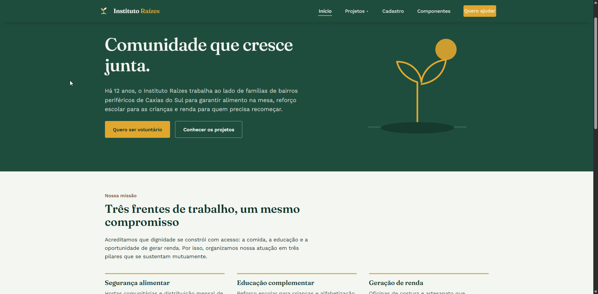

# Instituto Raízes — Site Institucional

Projeto de site institucional desenvolvido para o **Instituto Raízes**, uma organização fictícia de apoio a famílias em situação de vulnerabilidade em Caxias do Sul (RS). O objetivo foi construir uma plataforma completa com múltiplas páginas, formulário de cadastro de voluntários e uma biblioteca de componentes de feedback reutilizáveis.

**[Clique aqui para ver o projeto online](https://acali10.github.io/DesenvolvimentoFront/)**

---

## Demonstração



---

## Tecnologias e Conceitos Aplicados

- **HTML5 Semântico:** uso de `<header>`, `<main>`, `<footer>`, `<nav>`, `<article>` e `<section>` para estruturar o conteúdo, facilitando a navegação por leitores de tela.

- **CSS com Design Tokens:** variáveis CSS (`:root`) para padronizar cores, tipografia e espaçamento em todas as páginas, garantindo consistência visual.

- **Sistema de Grid de 12 Colunas:** layout construído com `grid-template-columns: repeat(12, 1fr)`, permitindo dividir o espaço em blocos proporcionais.

- **Flexbox:** usado para alinhar componentes em linha (cabeçalho, botões, formulário) e distribuir espaços verticalmente.

- **Media Queries e Responsividade:** breakpoints em 900px, 840px, 780px e 480px para adaptar o layout a tablets e celulares.

- **JavaScript Modular (ES6 Modules):** código dividido em `nav.js`, `feedback.js`, `forms.js` e `main.js`, com `import` e `export` explícitos, mantendo coesão e baixo acoplamento.

- **Componentes de Feedback:** badges, alerts, toasts e modal implementados de forma reutilizável, com variações semânticas (success, warning, danger, info).

- **Acessibilidade:** atributos ARIA (`aria-expanded`, `aria-invalid`, `aria-live`, `aria-modal`), foco preso no modal, fechamento por ESC, link de pular para o conteúdo e foco visível em todos os elementos interativos.

- **Validação de Formulário em Três Camadas:** validação nativa do HTML (`required`, `pattern`, `minlength`), validação customizada em JavaScript (CPF por módulo 11, telefone, CEP) e feedback visual por meio de classes CSS (`has-error`).

- **Integração com API ViaCEP:** preenchimento automático de endereço (rua, bairro, cidade, UF) a partir do CEP, usando `fetch` e tratamento de erros com `try/catch`.

- **Persistência em localStorage:** rascunho do formulário de cadastro salvo automaticamente e restaurado ao recarregar a página, evitando perda de dados.

---

## O que aprendi

Este projeto foi meu primeiro contato prático com um site de múltiplas páginas que precisava ser coeso e acessível ao mesmo tempo. Aprendi que separar responsabilidades não é só uma boa prática, é uma necessidade: quando todo o JavaScript estava em um único arquivo, um `return` precoce impedia que códigos posteriores rodassem em páginas sem formulário. Refatorar em módulos ES6 resolveu o problema e me mostrou na prática o que significa coesão e acoplamento baixo.

Também aprendi a importância de tratar acessibilidade como parte da funcionalidade, e não como detalhe. Implementar foco preso no modal, fechar por ESC, anunciar toasts com `aria-live` e validar campos com `aria-invalid` mudou minha forma de escrever código.

Outro aprendizado foi a validação de CPF por módulo 11. O atributo `pattern` do HTML cobre apenas o formato, mas aceita valores matematicamente inválidos. Implementar a verificação real dos dígitos verificadores me ensinou a diferença entre validação de formato e validação de conteúdo.

Por fim, a persistência em `localStorage` me mostrou como armazenar dados sem back-end, convertendo objetos para string com `JSON.stringify()` e recuperando com `JSON.parse()`, sempre protegendo a operação com `try/catch`.

---

## Como rodar o projeto localmente

1. Clone o repositório:

   ```bash
   git clone https://github.com/acali10/DesenvolvimentoFront.git
   ```

2. Acesse a pasta do projeto:

   ```bash
   cd DesenvolvimentoFront
   ```

3. Abra o arquivo `index.html` no navegador — ou, se preferir, use a extensão **Live Server** do VS Code para rodar com recarregamento automático.

> **Observação:** como o projeto usa ES6 Modules (`type="module"`), é necessário abrir por um servidor local (como o Live Server) e não por duplo-clique no arquivo. Caso contrário, o navegador bloqueará os `import` por política de CORS.

---

## Melhorias futuras

- Adicionar um `alt` descritivo nas ilustrações SVG do hero e dos projetos.
- Converter as imagens para `.webp` visando otimização de carregamento.
- Implementar testes automatizados para as funções de validação (`isValidCPF`, máscaras).
- Estudar bundlers como **Vite** ou **Webpack** para otimizar o carregamento de módulos em produção.
- Migrar a persistência de `localStorage` para **IndexedDB**, caso o volume de dados cresça.
- Adicionar suporte a dark mode aproveitando as variáveis CSS já existentes.

---

## Autora

Desenvolvido por **Caline Nepomoceno**:

- GitHub: [@acali10](https://github.com/acali10)

<!-- Versão inicial do README -->